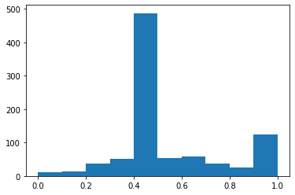

# Instagram_Reviews_Emotion_Classifier
Classify reviews under several instagram posts. Positive/Negative first, then focus on multiple emotions.

Raw data is fetched using `instaloader`, saved at `Raw_Insta_text`. Clean and merged using `instagram_data_reader.py`.

Fetched from the most recent 10 posts from the users `thecaratclub`, `_mountainbikezone`, `ridecake` and `airpods_case_1`. Each of them contains 347, 55, 372, 124 comments, in total 898 comments.

The final result is saved into the table `Cleaned_Insta_text/Instagram4_with_label.csv`. The description of the table header is as follows:

|                       | Describe                                                     |
| --------------------- | ------------------------------------------------------------ |
| id                    | comment id                                                   |
| created_at            | time (unix timestamp)                                        |
| post_host             | comment under username: "post_host"                          |
| label                 | Positive/ Negative   (Positive: 1 ; Negative:0)              |
| logits                | Original Neural Network Sigmoid output. Range: `[0.0, 1.0]`. <br />label = round(logits) |
| text                  | original text                                                |
| likes_count           |                                                              |
| answers               | replys to this comment                                       |
| owner.id              | comment ower information                                     |
| owner.is_verified     |                                                              |
| owner.profile_pic_url |                                                              |
| owner.username        |                                                              |

Here, `label` means Positive or Negative emotion; `logits` means the raw output of the network, ranged from 0 to 1.


The distribution of the label is:


```python
>>> df['label'].value_counts()
0    600
1    298
```

There are 600 negative comments and 298 positive comments.


The distribution of logits is:



```python
>>> df['logits'].describe()
count    898.000000
mean       0.525614
std        0.217962
min        0.010000
25%        0.417250
50%        0.422000
75%        0.640500
max        0.992000
```

Besides the statistic information, we can see that most negative data has an output range from 0.4 to 0.5.

