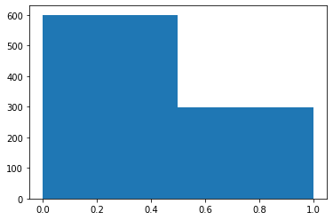
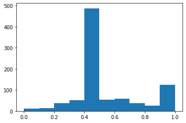

取自四个用户 `thecaratclub`, `_mountainbikezone`, `ridecake`, `airpods_case_1` 最近10条post,

每个用户分别有347, 55, 372, 124条comments, 共计898条comments.


最终结果(包括情绪分析)另存为表格`Instagram4_with_label.csv`.

表头为

|      | Describe |
|-|-|
|id| comment id |
|created_at| time (unix timestamp) |
|post_host| comment under username: "post_host" |
|label| Positive/ Negative   (Positive: 1 ; Negative:0) |
|logits| Original Neural Network Sigmoid output. Range: `[0.0, 1.0]`. <br />label = round(logits) |
|text| original text |
|likes_count| |
|answers| replys to this comment |
|owner.id| comment ower information |
|owner.is_verified| |
|owner.profile_pic_url| |
|owner.username| |

label为最终Positive/Negative情绪, logits为网络原始输出, 范围 0~1.

就label进行分析, 如图:



```python
>>> df['label'].value_counts()
0    600
1    298
```

总计有600条Negative, 298条Positive Comments.


就logits进行分析:



```python
>>> df['logits'].describe()
count    898.000000
mean       0.525614
std        0.217962
min        0.010000
25%        0.417250
50%        0.422000
75%        0.640500
max        0.992000
```

除上述statistics信息外, 可发现大部分Negative数据集中在0.4~0.5区间.